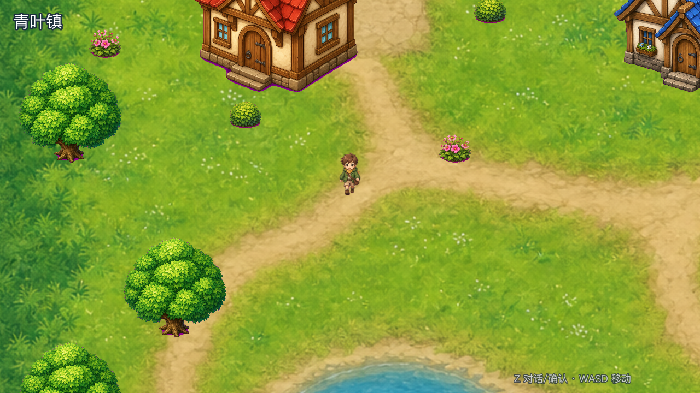
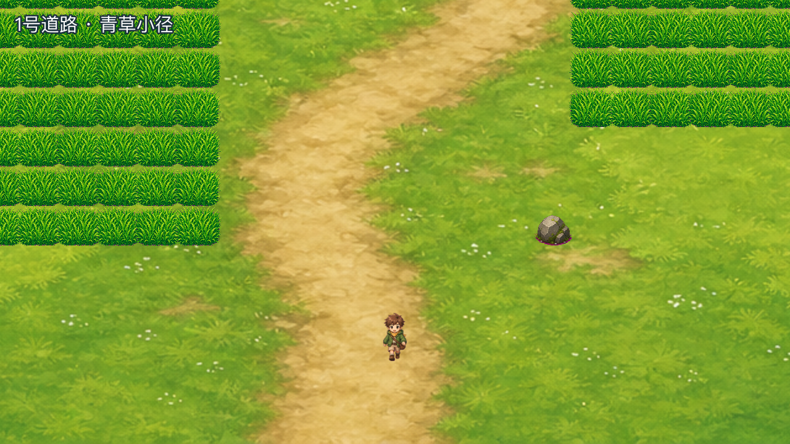
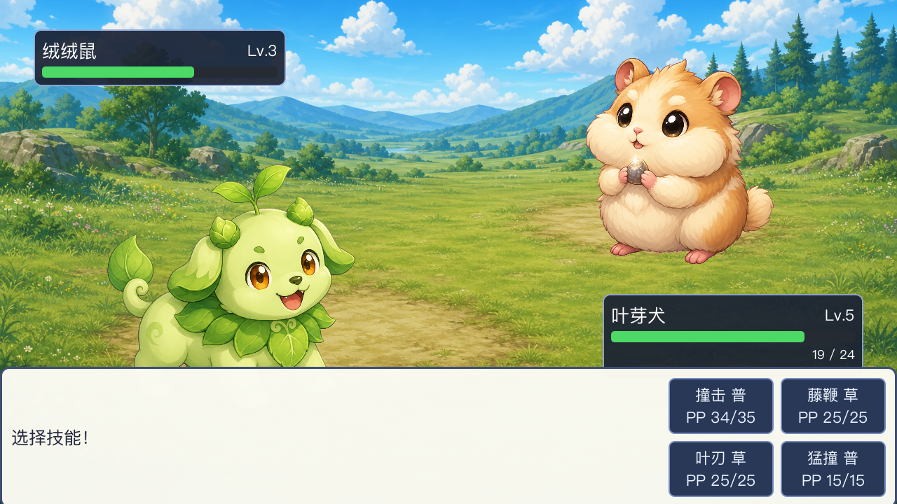

# 宝可梦·青叶物语（Beastbound）

一款中文原创的宝可梦风格 2D 回合制 RPG，使用 **Godot 4** 开发。所有美术资产（地图、角色、宝可梦、背景）均由 AI 生成的原创设计，不含任何官方版权素材。


## 玩法

- 在 **青叶镇** 出生，找博士领取御三家（叶芽犬·草 / 炎尾狐·火 / 水灵螈·水）
- 北上 **1 号道路**，在草丛中遭遇野生宝可梦（绒绒鼠 / 啾啾雀 / 菇菇虫）
- 回合制战斗：属性克制、会心一击、STAB 加成、捕捉、经验升级
- 背包道具：宝可球捕捉、伤药回复
- 与劲敌小焰对战，证明自己的实力

| 城镇探索 | 草丛遇敌 |
| --- | --- |
|  |  |



## 操作

| 按键 | 功能 |
| --- | --- |
| WASD / 方向键 | 移动 |
| Z / 回车 / 空格 | 确认 / 对话 / 交互 |
| X / Esc | 取消 |

## 运行

需要安装 [Godot 4.x](https://godotengine.org/)。

```bash
godot --path client/godot
```

### 调试参数

游戏内置自动化调试工具（`Shot` autoload），可用于截图与自动试玩：

```bash
# 截取标题画面
godot --path client/godot -- --shot /tmp/title.png --frames 45

# 直接进入战斗并自动推进
godot --path client/godot -- --shot /tmp/battle.png --frames 200 --start battle --auto-confirm

# 自动走入草丛触发遇敌（完整试玩链路）
godot --path client/godot -- --shot /tmp/play.png --frames 1500 --start world --pick 0 \
  --map route1 --cell 10,14 --walk "ddrruullddrruull" --auto-confirm
```

## 项目结构

```
client/godot/          Godot 4 项目
  scripts/             GDScript（世界探索 / 回合战斗 / UI / 数据库）
  data/                地图与道具 JSON 配置
  assets/              处理后的游戏素材（透明 PNG）
art-src/               AI 生成原始素材与提示词存档
tools/                 图像处理脚本
```

## 原创宝可梦图鉴

| 名称 | 属性 | 定位 |
| --- | --- | --- |
| 叶芽犬 | 草 | 御三家 |
| 炎尾狐 | 火 | 御三家 |
| 水灵螈 | 水 | 御三家 |
| 绒绒鼠 | 普通 | 野生 |
| 啾啾雀 | 飞行 | 野生 |
| 菇菇虫 | 虫/草 | 野生 |
